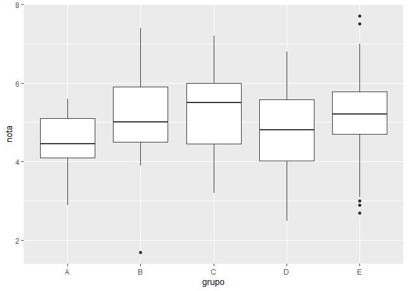
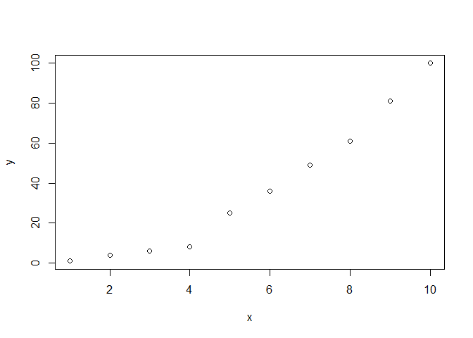

Tarea 6 Ejercicios
================
angie
16/7/2021

``` r
#PARTE 1

#Pregunta N°1

#a
0.3*0.15/(0.3*0.15+0.2*0.8+0.5*0.12)
```

    ## [1] 0.1698113

``` r
#b
(5^6/factorial(6))*exp(-5)
```

    ## [1] 0.1462228

``` r
#c
(factorial(20)*(0.4)^7*(0.6)^13)/(factorial(7)*factorial(13))
```

    ## [1] 0.1658823

``` r
#Pregunta N°2

#a
sum(1:1000)
```

    ## [1] 500500

``` r
#b
sum((1:512)*2)+1
```

    ## [1] 262657

``` r
#Pregunta N°3

load("C:/Users/angie/Downloads/ei1012-1516-la-s1-datos (3).RData")
grupo
```

    ##   [1] "B" "A" "E" "D" "B" "D" "D" "A" "D" "C" "D" "E" "B" "E" "E" "E" "A" "B"
    ##  [19] "C" "C" "A" "C" "C" "D" "D" "E" "E" "A" "B" "C" "C" "E" "D" "C" "E" "E"
    ##  [37] "E" "E" "D" "D" "D" "E" "E" "E" "D" "E" "B" "E" "D" "C" "E" "D" "E" "E"
    ##  [55] "C" "B" "D" "C" "E" "D" "E" "B" "D" "B" "B" "C" "D" "C" "C" "C" "E" "D"
    ##  [73] "E" "D" "C" "D" "E" "E" "C" "D" "C" "E" "D" "A" "B" "B" "E" "E" "C" "D"
    ##  [91] "C" "E" "E" "C" "E" "D" "D" "D" "E" "D" "A" "D" "B" "B" "C" "D" "E" "A"
    ## [109] "E" "E" "A" "C" "E" "D" "A" "D" "D" "C" "E" "E" "E" "D" "A" "E" "E" "E"
    ## [127] "C" "C" "B" "C" "C" "D" "C" "B" "C" "A" "D" "E" "D" "E" "E" "B" "E" "E"
    ## [145] "E" "E" "C" "B" "D" "D" "E" "E" "D" "D" "E" "D" "E" "D" "D" "C" "D" "D"
    ## [163] "D" "C" "E" "D" "E" "C" "E" "B" "C" "C" "C" "D" "D" "B" "D" "B" "E" "C"
    ## [181] "E" "D" "D" "E" "D" "B" "B" "E" "E" "A" "C" "A"

``` r
#a
length(grupo)
```

    ## [1] 192

``` r
#b
which(grupo == "A")
```

    ##  [1]   2   8  17  21  28  84 101 108 111 115 123 136 190 192

``` r
#Pregunta N°4

#a
nota
```

    ##   [1] 4.9 5.4 5.2 6.8 5.0 6.2 4.4 4.1 4.3 5.5 5.5 4.8 6.4 6.8 5.5 4.7 5.2 6.4
    ##  [19] 4.8 3.4 4.7 6.0 5.9 5.4 5.3 5.6 6.9 5.6 4.2 4.4 5.8 4.8 6.1 6.2 6.6 5.2
    ##  [37] 4.6 5.0 2.5 4.0 5.6 4.9 5.4 3.9 4.2 4.7 4.2 5.4 3.7 6.2 5.9 3.7 5.8 2.7
    ##  [55] 5.6 5.0 2.6 5.0 4.9 3.4 5.9 4.3 6.1 4.5 5.5 3.2 3.2 6.4 4.4 6.0 5.0 5.4
    ##  [73] 7.0 3.8 4.2 4.7 4.7 5.3 6.8 4.0 7.2 4.8 6.0 4.1 4.5 5.8 2.9 5.0 4.6 4.9
    ##  [91] 6.8 4.2 6.9 5.7 5.7 6.4 4.4 4.2 4.5 5.8 4.3 3.7 7.4 3.9 5.2 4.9 3.6 5.5
    ## [109] 6.0 5.0 4.1 4.5 3.1 5.4 4.5 5.3 4.7 6.1 5.2 7.7 5.3 5.0 4.0 5.2 4.0 5.5
    ## [127] 4.0 5.4 4.6 3.4 6.2 5.7 3.8 4.8 4.0 4.4 5.5 5.9 5.9 5.7 4.9 1.7 5.5 5.9
    ## [145] 5.5 3.8 5.5 6.0 3.5 5.5 7.5 3.4 5.8 4.7 3.6 4.1 5.0 4.6 3.6 4.7 4.1 5.7
    ## [163] 5.9 4.7 3.2 5.5 3.0 4.5 5.5 5.9 5.6 6.0 4.4 3.7 4.4 6.8 6.1 4.7 4.2 6.2
    ## [181] 5.2 5.1 2.9 6.5 4.2 5.4 5.9 6.2 6.3 4.8 5.6 2.9

``` r
sum(nota)
```

    ## [1] 962

``` r
#b
mean(nota)
```

    ## [1] 5.010417

``` r
#c
which(nota> 7.0)
```

    ## [1]  81 103 120 151

``` r
#d
sort(nota,decreasing = T)
```

    ##   [1] 7.7 7.5 7.4 7.2 7.0 6.9 6.9 6.8 6.8 6.8 6.8 6.8 6.6 6.5 6.4 6.4 6.4 6.4
    ##  [19] 6.3 6.2 6.2 6.2 6.2 6.2 6.2 6.1 6.1 6.1 6.1 6.0 6.0 6.0 6.0 6.0 6.0 5.9
    ##  [37] 5.9 5.9 5.9 5.9 5.9 5.9 5.9 5.9 5.8 5.8 5.8 5.8 5.8 5.7 5.7 5.7 5.7 5.7
    ##  [55] 5.6 5.6 5.6 5.6 5.6 5.6 5.5 5.5 5.5 5.5 5.5 5.5 5.5 5.5 5.5 5.5 5.5 5.5
    ##  [73] 5.5 5.4 5.4 5.4 5.4 5.4 5.4 5.4 5.4 5.3 5.3 5.3 5.3 5.2 5.2 5.2 5.2 5.2
    ##  [91] 5.2 5.2 5.1 5.0 5.0 5.0 5.0 5.0 5.0 5.0 5.0 5.0 4.9 4.9 4.9 4.9 4.9 4.9
    ## [109] 4.8 4.8 4.8 4.8 4.8 4.8 4.7 4.7 4.7 4.7 4.7 4.7 4.7 4.7 4.7 4.7 4.6 4.6
    ## [127] 4.6 4.6 4.5 4.5 4.5 4.5 4.5 4.5 4.4 4.4 4.4 4.4 4.4 4.4 4.4 4.3 4.3 4.3
    ## [145] 4.2 4.2 4.2 4.2 4.2 4.2 4.2 4.2 4.1 4.1 4.1 4.1 4.1 4.0 4.0 4.0 4.0 4.0
    ## [163] 4.0 3.9 3.9 3.8 3.8 3.8 3.7 3.7 3.7 3.7 3.6 3.6 3.6 3.5 3.4 3.4 3.4 3.4
    ## [181] 3.2 3.2 3.2 3.1 3.0 2.9 2.9 2.9 2.7 2.6 2.5 1.7

``` r
#e
which(nota == max(nota))
```

    ## [1] 120

``` r
#Pregunta N°5

#a
sum(nota[1:10])
```

    ## [1] 51.8

``` r
#b
length(grupo[grupo == "C"])
```

    ## [1] 39

``` r
#c
length(nota[nota>=5])
```

    ## [1] 102

``` r
#d
length(nota[grupo == "B" & nota >= 5])
```

    ## [1] 12

``` r
#e
length((nota [grupo == "C" & 
                nota >= 5])/(length(nota[
                  grupo == "C"])*100))
```

    ## [1] 23

``` r
#f
grupo[nota == max(nota)]
```

    ## [1] "E"

``` r
grupo[nota == min(nota)]
```

    ## [1] "B"

``` r
#g
library(dplyr)
```

    ## 
    ## Attaching package: 'dplyr'

    ## The following objects are masked from 'package:stats':
    ## 
    ##     filter, lag

    ## The following objects are masked from 'package:base':
    ## 
    ##     intersect, setdiff, setequal, union

``` r
notasTota <- dplyr::tibble(grupAyB = grupo,notAyB = nota)
notasTota %>%
  dplyr::filter((grupAyB == "A" & notAyB >= 5)|(grupAyB == "B" & notAyB >= 5)) %>%
  dplyr::summarise(mean(notAyB))
```

    ## # A tibble: 1 x 1
    ##   `mean(notAyB)`
    ##            <dbl>
    ## 1           5.82

``` r
#Pregunta N°6

#a
#cuantil 66 de todos
quantile(nota, probs = 0.66)
```

    ## 66% 
    ## 5.5

``` r
#cuantil 66 del grupo "C" 
quantile(nota[grupo == "C"], probs = 0.66)
```

    ##   66% 
    ## 5.808

``` r
#Pregunta N°7

#Porcentaje del total de alumnos que tienen una nota menor o igual que 4.9 
((length(nota[nota <= 4.9 ]))/(length(nota)))*100
```

    ## [1] 46.875

``` r
#porcentaje mayor o igual que 4.9
((length(nota[nota >= 4.9]))/(length(nota)))*100
```

    ## [1] 56.25

``` r
#Pregunta N°8

#Gráfico de diagramas de caja de las notas de cada grupo, para poder comparar el nivel de cada uno de ellos.

library(ggplot2)
```

    ## Warning in (function (kind = NULL, normal.kind = NULL, sample.kind = NULL) :
    ## non-uniform 'Rounding' sampler used

``` r
notasTota <- dplyr::tibble(grupo, nota)
notasTota %>% ggplot(mapping = aes(x = grupo, y = nota)) +
  geom_boxplot()
```

<!-- -->

``` r
#Pregunta N°9

#Si la variable conc recoge la concentración de plomo (en ppm) en el aire de cierta zona durante un día completo

#a. La concentración máxima
load("C:/Users/angie/Downloads/ei1012-1516-la-s1-datos (3).RData")
max(conc)
```

    ## [1] 47.34

``` r
#b. Cantidad de muestreo que ha superado la concentración de 40.0 ppm
length(conc[conc > 40.0])
```

    ## [1] 61

``` r
#c. La concentración media del día
mean(conc)
```

    ## [1] 24.07229

``` r
#d. Las 10 mediciones más bajas del día 
sort(conc)[1:10]
```

    ##  [1] 0.93 1.07 1.77 2.03 2.58 2.73 2.75 2.88 2.88 2.91

``` r
#e. Hora del día que se alcanzó la máxima concentración
fecha <- seq(
  as.POSIXct("2021-01-01 00:00"),
  length.out = length(conc),
  by = "10 min"
)

#PARTE 2

#Pregunta N°1
#Gráfico de un plano utilizando Rstudio de los siguientes puntos:
x<-c(1,2,3,4,5,6,7,8,9,10)
y<-c(1,4,6,8,25,36,49,61,81,100)
plot(x,y)
```

<!-- -->

``` r
#Pregunta N°2

#Matriz A en Rstudio
i<-c(1,2,3,4,2,4,6,8,3,6,9,12)
A<-matrix(i,ncol = 3,nrow = 4)

#Pregunta N°3

#Matriz identidad de tamaño 3I
3*diag(3)
```

    ##      [,1] [,2] [,3]
    ## [1,]    3    0    0
    ## [2,]    0    3    0
    ## [3,]    0    0    3

``` r
#Pregunta N°4
#Crea una función que cree una matriz nula ingresando las dimensiones
matrizN<-function(f,c){
  P<-matrix(0,nrow = f,ncol = c)
  return(P)
}
matrizN(5,4)
```

    ##      [,1] [,2] [,3] [,4]
    ## [1,]    0    0    0    0
    ## [2,]    0    0    0    0
    ## [3,]    0    0    0    0
    ## [4,]    0    0    0    0
    ## [5,]    0    0    0    0

``` r
#Pregunta N°5
B<-diag(4)
B[1,1]<-0
B[2,2]<-2
B[3,3]<-3
B[4,4]<-4
B
```

    ##      [,1] [,2] [,3] [,4]
    ## [1,]    0    0    0    0
    ## [2,]    0    2    0    0
    ## [3,]    0    0    3    0
    ## [4,]    0    0    0    4

``` r
#Pregunta N°6

#La matriz transpuesta de A del ejercicio 2
t(A)
```

    ##      [,1] [,2] [,3] [,4]
    ## [1,]    1    2    3    4
    ## [2,]    2    4    6    8
    ## [3,]    3    6    9   12

``` r
#Pregunta N°7

#Las dimensiones son incompatibles.
#A+B 

#Las dimensiones son incompatibles.
#A-B 

# La matriz de la pregunta 5 por tres
3*B
```

    ##      [,1] [,2] [,3] [,4]
    ## [1,]    0    0    0    0
    ## [2,]    0    6    0    0
    ## [3,]    0    0    9    0
    ## [4,]    0    0    0   12

``` r
#Filas y columnas diferentes
#A%*%B 

#Pregunta N°8

m<-function(e){
  d<-c(1,-2,1,2,4,0,3,-2,1)
  m<-matrix(d,ncol = 3)
  r<-m^e
  return(r)
}
m(6)
```

    ##      [,1] [,2] [,3]
    ## [1,]    1   64  729
    ## [2,]   64 4096   64
    ## [3,]    1    0    1
