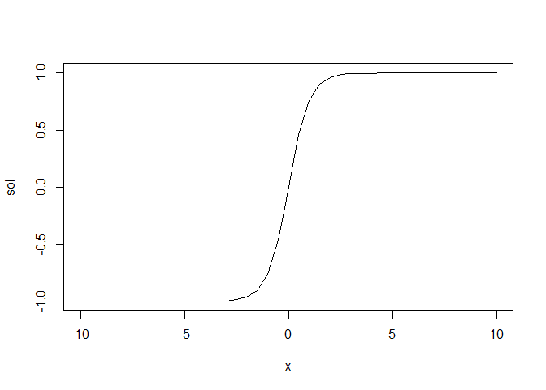

examen parcial
================
angie
24/7/2021

``` r
#PARTE 1
#Pregunta N°1
x<- c(seq(from= -10,to=10,by = 0.5))
x
```

    ##  [1] -10.0  -9.5  -9.0  -8.5  -8.0  -7.5  -7.0  -6.5  -6.0  -5.5  -5.0  -4.5
    ## [13]  -4.0  -3.5  -3.0  -2.5  -2.0  -1.5  -1.0  -0.5   0.0   0.5   1.0   1.5
    ## [25]   2.0   2.5   3.0   3.5   4.0   4.5   5.0   5.5   6.0   6.5   7.0   7.5
    ## [37]   8.0   8.5   9.0   9.5  10.0

``` r
tanh<-function(m){
  r<-(exp(2*m)-1)/(exp(2*m)+1)
  return(r)
}
sol<-tanh(x)
plot(x,sol,type="l")
```

<!-- -->

``` r
#Pregunta N°2
ERP<-function(v1,v2){
  Xp<-c()
  Yp<-c()
  for(i in 1:length(v1)){
    x<-log10(v1[i])
    y<-log10(v2[i])
    Xp<-c(Xp,x)
    Yp<-c(Yp,y)
  }
  prod<-Xp*Yp
  Xp_cuadrado<-Xp^2
  m<-length(v1)
  B<-(((m*sum(prod))-(sum(Xp)*sum(Yp)))/((m*sum(Xp_cuadrado))-(sum(Xp))^2))
  A<-10^(mean(Yp)-B*mean(Xp))
  return(c(A,B))
}
x<-c(2.5,3,4,5,5.5,6,7)
y<-c(12.5,10,7,4.5,4,3,3.5)
ERP(x,y)
```

    ## [1] 46.496564 -1.421563

``` r
#Pregunta N°3
#Area del triángulo
a <- 3
b <- 4
c <- 5
#angulo entre lados concecutivos(en radiales)
M <- 60*pi/180
sin(M)
```

    ## [1] 0.8660254

``` r
Area <- function(valor1, valor2) {
  S <- (valor1*valor2)*(sin(M))/2
  return(S)
}
Area(a,b)
```

    ## [1] 5.196152

``` r
#perímetro del triángulo
perimetro<- function(valor1, valor2, valor3) {
  P <- valor1+valor2+valor3
  return(P)
}
perimetro(a,b,c)
```

    ## [1] 12

``` r
#Pregunta N°4

#Pregunta N°5
CSSE<-function(v,r){
  m<-matrix(v,ncol = 3)
  ds<-det(m)
  for (n in 1:length(r)) {
    if(n==1){
      m<-matrix(v,ncol = 3)
      m[,n]<-r
      dx<-det(m)
    }else if(n==2){
      m<-matrix(v,ncol = 3)
      m[,n]<-r
      dy<-det(m)
    }else{
      m<-matrix(v,ncol = 3)
      m[,n]<-r
      dz<-det(m)
    }
  }
  x<-dx/ds
  y<-dy/ds
  z<-dz/ds
  r<-c(x,y,z)
  return(r)
}
xyz<-c(2,5,1,1,-4,-1,3,1,-4)
SE<-c(7,-19,4)
CSSE(xyz,SE)
```

    ## [1]  2.923077  7.846154 -2.230769
