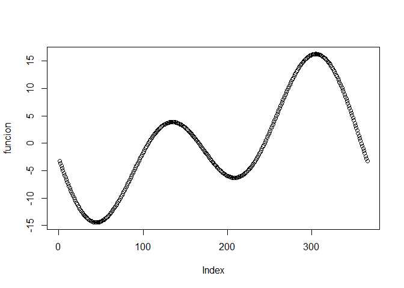

resolución de la práctica
================
angie
2/7/2021

*Primera Práctica*

``` r
#Pregunta 1
10000%%3
```

    ## [1] 1

``` r
## 1 es el residuo que nos da al repartir 10000/3

#Pregunta 2
4560%%3
```

    ## [1] 0

``` r
## El número 4560 es divisible por 3 ya que el residuo es 0.

#Pregunta 3
v1 <- c(2:87)
x<- v1%%7
x[x==0]
```

    ##  [1] 0 0 0 0 0 0 0 0 0 0 0 0

``` r
## nos sale que son 12 números divisibles por 7 ya que su residuo es 0.

#Pregunta 4
a1 <- c(7:3)
b2 <- c(seq(from=5, to=25, by=5))
A <- ifelse(a1%%2==0,"TRUE","FALSE")
B <- ifelse(b2>10,"TRUE","FALSE")
data.frame(A,B)
```

    ##       A     B
    ## 1 FALSE FALSE
    ## 2  TRUE FALSE
    ## 3 FALSE  TRUE
    ## 4  TRUE  TRUE
    ## 5 FALSE  TRUE

``` r
## el vector A y B cumplen las condiciones en la posición 4.

#PREGUNTA 5
x <- (1:100)
sum(1:100)
```

    ## [1] 5050

``` r
## la suma es 5050

#PREGUNTA 6
x5 <- c(1,-4,4,9,-4)
min(x5)
```

    ## [1] -4

``` r
nivel <- c(1,-4,4,9,-4)
nivel[2]
```

    ## [1] -4

``` r
nivel[5]
```

    ## [1] -4

``` r
ifelse(x5==min(x5),"VMIN","OTRO")
```

    ## [1] "OTRO" "VMIN" "OTRO" "OTRO" "VMIN"

``` r
### las posiciones donde están el valor mínimo son 2 y 5.

# PREGUNTA 7
factorial(8)
```

    ## [1] 40320

``` r
prod(1:8)
```

    ## [1] 40320

``` r
## Rpta:40320

# PREGUNTA 8
i<- 3:7
sum(exp(i))
```

    ## [1] 1723.159

``` r
## Rpta:1723.159

# PREGUNTA 9
i<-1:10
prod(log(sqrt(i)))
```

    ## [1] 0

``` r
## Rpta:0

#PREGUNTA 10
R=25
teta= pi/36 
d=R/2
ar1 <- function(R,teta){
  result <- (((pi*(R^2))*teta)/360)
  return(result)
}
area1 <- ar1(25,pi/36)
area1
```

    ## [1] 0.4759647

``` r
ar2 <- function(d,R){
  result2 <- (sqrt(R^2 - d^2))
  return(result2)
}
area2 <-ar2(d,R)
area2
```

    ## [1] 21.65064

``` r
ar_final <- area1 - area2
ar_final
```

    ## [1] -21.17467

``` r
# PREGUNTA 11
a<- 1:10
b<- 10:1
v_c<- c(21, 30, 22, 17, 18, 16)
rev(v_c)
```

    ## [1] 16 18 17 22 30 21

``` r
# PREGUNTA 12
i<- 10:100
sum(i^3+ 4*i^2)
```

    ## [1] 26852735

``` r
## Rpta:26852735

# PREGUNTA 13
i<- 1:25
sum(2^i/i +3^i/i^2)
```

    ## [1] 2129170437

``` r
## Rpta:2129170437

#PREGUNTA 14
d_f<-read.csv("https://raw.githubusercontent.com/fhernanb/datos/master/Paises.txt",sep="",dec=".")

length(d_f)
```

    ## [1] 5

``` r
## el número de variables es 5

length(d_f[,1])
```

    ## [1] 107

``` r
## hay 107 países

d_f[d_f$poblacion==max(d_f[,2]),]
```

    ##      Pais poblacion alfabetizacion tasamortinf PIB
    ## 25 China_   1205200             78          52 377

``` r
##el país con mayor población es China

d_f[d_f$alfabetizacion==min(d_f[,3]),]
```

    ##            Pais poblacion alfabetizacion tasamortinf PIB
    ## 19 Burkina_Faso     10000             18         118 357

``` r
##el país con mayor alfabetización es Burkina_ Faso

#PREGUNTA 15

df<-mtcars
df[df$mpg<18.0,]
```

    ##                      mpg cyl  disp  hp drat    wt  qsec vs am gear carb
    ## Duster 360          14.3   8 360.0 245 3.21 3.570 15.84  0  0    3    4
    ## Merc 280C           17.8   6 167.6 123 3.92 3.440 18.90  1  0    4    4
    ## Merc 450SE          16.4   8 275.8 180 3.07 4.070 17.40  0  0    3    3
    ## Merc 450SL          17.3   8 275.8 180 3.07 3.730 17.60  0  0    3    3
    ## Merc 450SLC         15.2   8 275.8 180 3.07 3.780 18.00  0  0    3    3
    ## Cadillac Fleetwood  10.4   8 472.0 205 2.93 5.250 17.98  0  0    3    4
    ## Lincoln Continental 10.4   8 460.0 215 3.00 5.424 17.82  0  0    3    4
    ## Chrysler Imperial   14.7   8 440.0 230 3.23 5.345 17.42  0  0    3    4
    ## Dodge Challenger    15.5   8 318.0 150 2.76 3.520 16.87  0  0    3    2
    ## AMC Javelin         15.2   8 304.0 150 3.15 3.435 17.30  0  0    3    2
    ## Camaro Z28          13.3   8 350.0 245 3.73 3.840 15.41  0  0    3    4
    ## Ford Pantera L      15.8   8 351.0 264 4.22 3.170 14.50  0  1    5    4
    ## Maserati Bora       15.0   8 301.0 335 3.54 3.570 14.60  0  1    5    8

``` r
df[df$cyl==4,]
```

    ##                 mpg cyl  disp  hp drat    wt  qsec vs am gear carb
    ## Datsun 710     22.8   4 108.0  93 3.85 2.320 18.61  1  1    4    1
    ## Merc 240D      24.4   4 146.7  62 3.69 3.190 20.00  1  0    4    2
    ## Merc 230       22.8   4 140.8  95 3.92 3.150 22.90  1  0    4    2
    ## Fiat 128       32.4   4  78.7  66 4.08 2.200 19.47  1  1    4    1
    ## Honda Civic    30.4   4  75.7  52 4.93 1.615 18.52  1  1    4    2
    ## Toyota Corolla 33.9   4  71.1  65 4.22 1.835 19.90  1  1    4    1
    ## Toyota Corona  21.5   4 120.1  97 3.70 2.465 20.01  1  0    3    1
    ## Fiat X1-9      27.3   4  79.0  66 4.08 1.935 18.90  1  1    4    1
    ## Porsche 914-2  26.0   4 120.3  91 4.43 2.140 16.70  0  1    5    2
    ## Lotus Europa   30.4   4  95.1 113 3.77 1.513 16.90  1  1    5    2
    ## Volvo 142E     21.4   4 121.0 109 4.11 2.780 18.60  1  1    4    2

``` r
df[df$wt>2.500&df$am==1,]
```

    ##                 mpg cyl disp  hp drat    wt  qsec vs am gear carb
    ## Mazda RX4      21.0   6  160 110 3.90 2.620 16.46  0  1    4    4
    ## Mazda RX4 Wag  21.0   6  160 110 3.90 2.875 17.02  0  1    4    4
    ## Ford Pantera L 15.8   8  351 264 4.22 3.170 14.50  0  1    5    4
    ## Ferrari Dino   19.7   6  145 175 3.62 2.770 15.50  0  1    5    6
    ## Maserati Bora  15.0   8  301 335 3.54 3.570 14.60  0  1    5    8
    ## Volvo 142E     21.4   4  121 109 4.11 2.780 18.60  1  1    4    2

``` r
#PREGUNTA 16

x<-0:365
y<-pi*2*(x-81)/365
funcion<-9.87*sin(2*y)-7.35*cos(y)-1.5*sin(y)
plot(funcion)
```

<!-- -->
